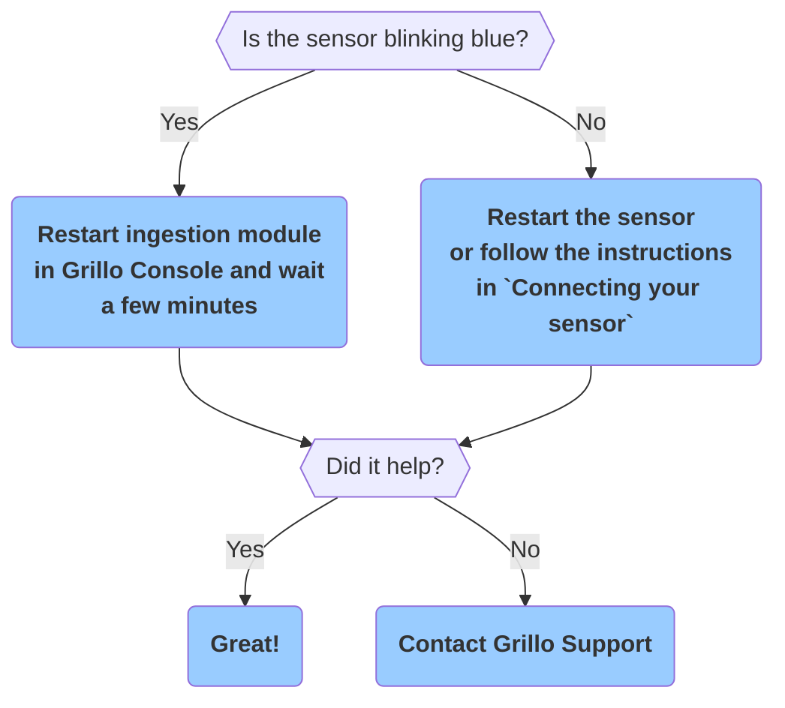

# Stations FAQ

<b>My station shows to be off in the Grillo Console.</b>

Please follow the flow below.

<b>How many stations can be associated with one account?</b>

The currrent limit is 200 stations. Please contact us if you need to onboard more stations.

