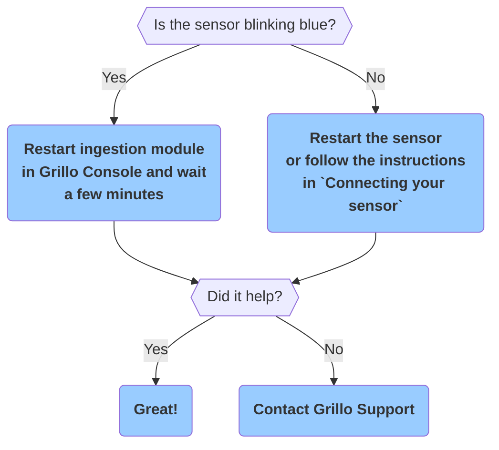
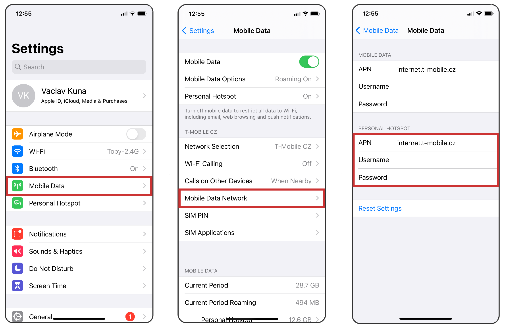

# Stations FAQ

<b>My station appears not connected in the Grillo Console.</b>

Please follow the flow below.

<b>How do I find network APN details?</b>

You can find APN details of your network by inserting the SIM card into your phone. On iPhone, follow these steps to get the APN details. Steps are similar on Android OS.

<b>How do I set up Network mode and Data transmission mode?</b>

`Grillo Air` can connect to either 2G (GSM) network, or LTE network Nb-IoT or CAT-M (also sometimes referred to as LTE-M). Grillo sensor should choose the best available option automatically. If not, you may need to define the desired option in APN setup after the sensor boots-up.
- To force the GSM option, set `GSM` to `1` and `LTE` to `0`
- To force either `Nb-IoT` or `CAT-M`, set the desired one to `1` and the other to `0` 

<b>Troubleshooting using serial output</b>

You can use the sensor serial output to track down the reasons of your connectivity problems.
To display the serial output on MAC OS system, follow these steps:
- Open `Terminal`
- Connect your Grillo Sensor to your computer via the USB-C connector on the sensor
- Find the correct port the sensor is connected to in `/dev/`. Grillo Connect is usually at `/dev/cu.SLAB_USBtoUART`
- Run `screen /dev/cu.SLAB_USBtoUART 115200` (replace serial port if needed)
- Restart your sensor to see the logs from the very beginning. If you need help interpreting the logs, please copy&paste them in a text file and contact us. We can help you to troubleshoot.

<b>How many stations can be associated with one account?</b>

The currrent limit is 200 stations. Please contact us if you need to onboard more stations.

