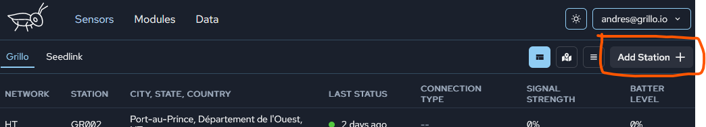
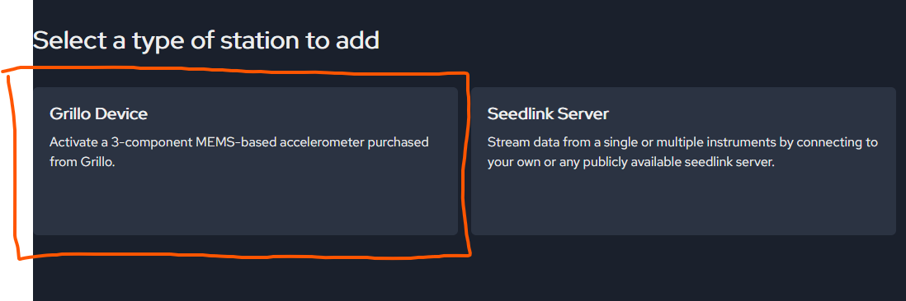
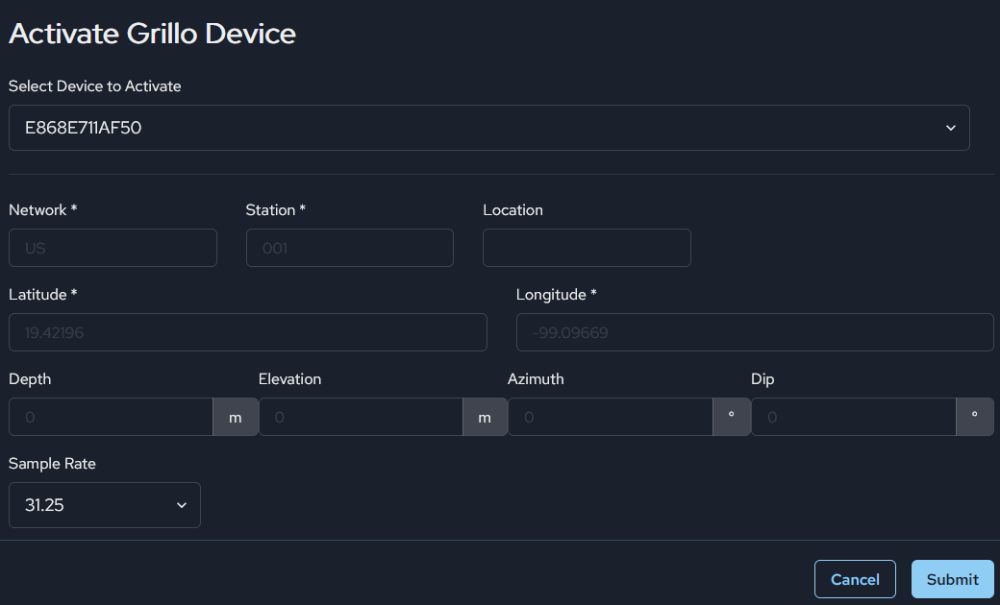
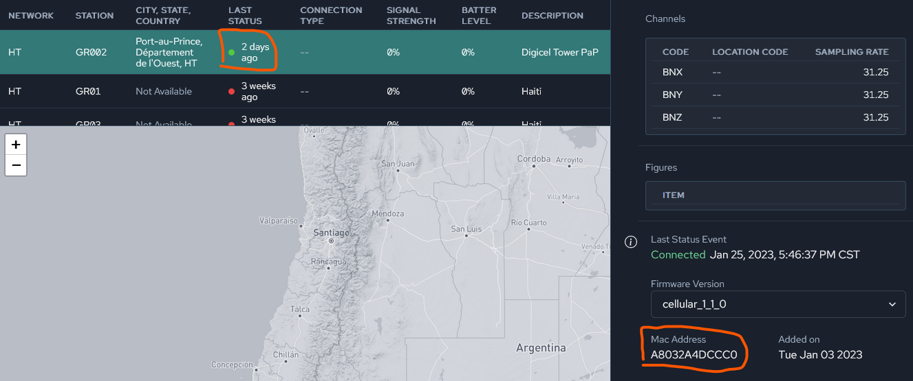

# Add Grillo Sensors
Grillo sensors can be easily connected to the Grillo Console with a few clicks.

## Connect your device
First, you will want your device to be connected to the cloud. This is done by powering it on and waiting until the onboard LEDs start blinking every second.
Now you are ready to activate it.

## Add to Grillo Console
Once you are logged in, go to the `Sensors` tab in the app, and click on `Add Station` button.

Choose Grillo sensor:

Choose from a list of devices that are registered to your acount, and then fill in the station information for this device:

Once this is all done, after a minute or so you should see your sensor as active in your sensor list:

Here you can confirm that the deviceID (`Mac Address`), as printed on your sensor, is the same one that is being shown.

It is recommended you don't change the firmware version unless you know what you are doing!