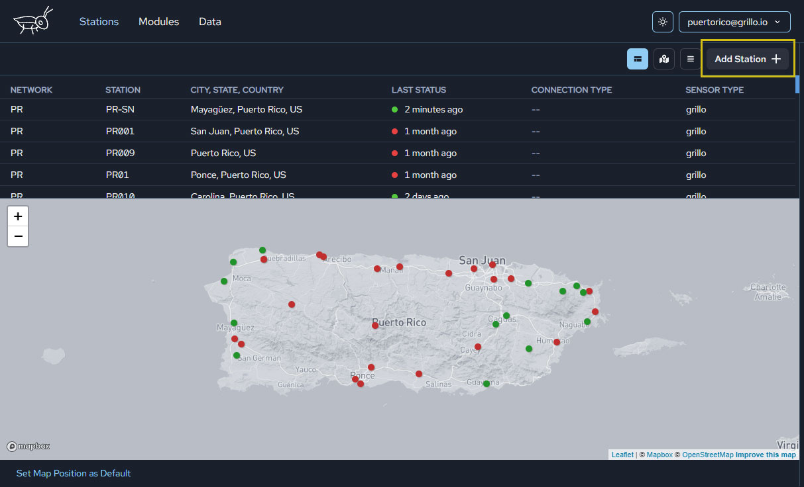

# Add SeedLink stations
You are able to add any SeedLink station to Grillo Console.

## Add to SeedLink to Grillo Console
Go to the `Stations` tab in the app, and click on `Add Station` button.

Choose SeedLink Server:

## Configure SeedLink Server
Having selected SeedLink server you can now add its details:

The required details include:
- **Host** This should be the URL address for the server.
- **Port** The port number associated with your server's Host address.
- **Network** This should be a short identifier for your seismic network. It should follow [FDSN conventions](https://www.fdsn.org/networks/) for Network Code.
- **Latitude** and **Longitude** These are required to locate your station.