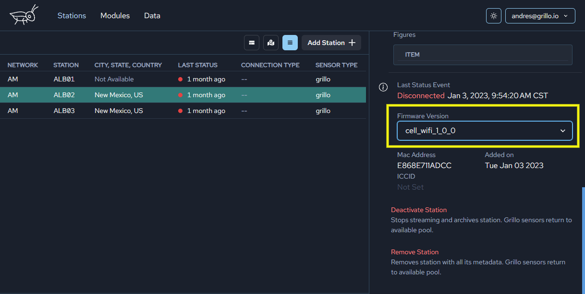

# Configure Grillo Sensors
From the Stations work space you are not only able to view key information about your sensor, but you can modify several properties.

## Transmission mode
Here you can tell the sensor to send continous telemetry or only on an acceleration threshold trigger.

## Firmware version
This allows a user to change the firmware version.

:::caution

Only use if you know which firmware you wish to use. Using this may break your device and lose connection.

:::

