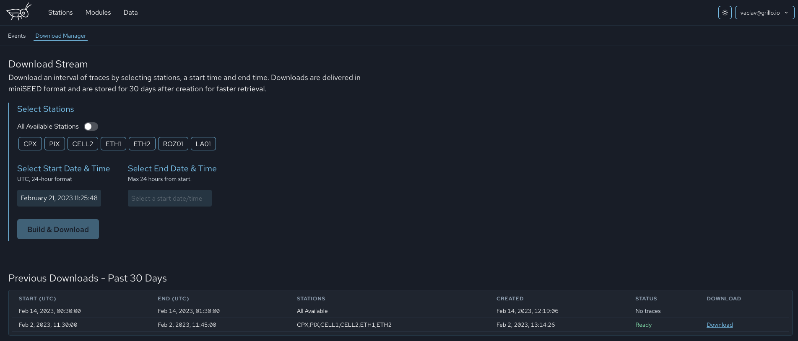

# Download Manager

:::note
Sensor data are archived in 10-minute-long segments so you may need to wait up to 10 minutes until your latest data arrive.
:::

The `Download Manager` serves for downloading archived data. When you select the timeframe and stations you wish to download and click `Build & Download`, the data will be prepared for you and downloaded to your local machine.

You will have access to your data selections for the next 30 days.

