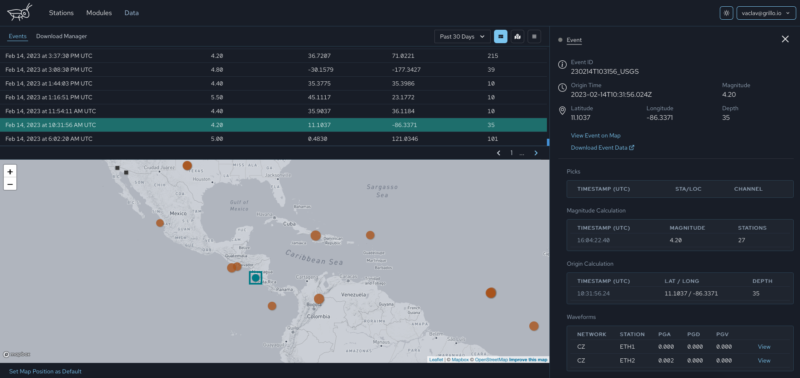

# Events
The `Event` page displays details about `Event` objects saved in the database. `Event` objects may be any seismic events, such as earthquakes, mine explosions, or even a threshold excedance and a single station.

The layout of the `Event` page is very similar to the `Station` page. The main table shows all the `Events` in the selected period, the right panel shows details of the event.

