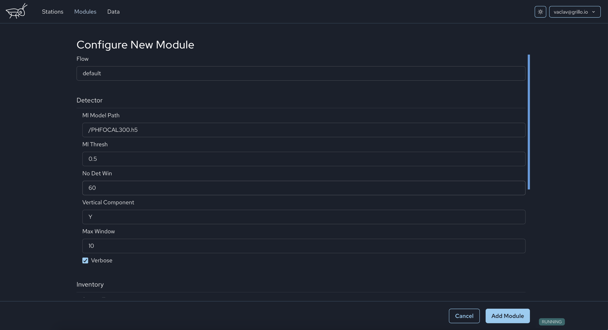

# Adding a module
You can start a `Module` by clicking `Add Module` button in the `Modules` tab.

Then you select a `Module` you wish to start. there are four categories of modules: `Data Management`, `Technical computing`, `Alerts`, and `Testing`.

You will be able to configure the `Module` before you start it. Some configuration items are unique to each `Module` (see the module page for the description), some items are common for all `Modules` and you will find the description [here](module_config.md).

