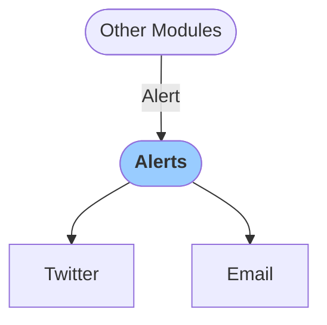

# Alerts
`Alerts` module distributes alerts to via various channels. Currently implemented channels include publishing to Twitter or Email.

```mermaid
flowchart TB
   B([Other Modules])-->|Alert| C([<font color=333333><b>Alerts</b>]) --> D[Twitter] & E[Email]
   style C fill:#99CCFF
```