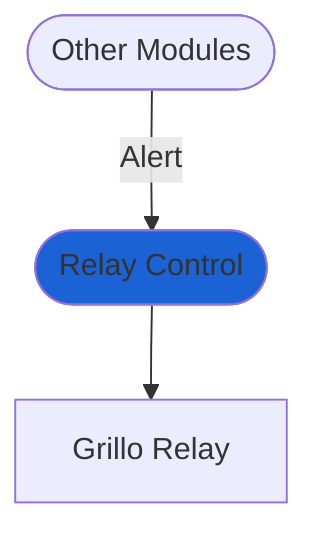

# Relay Control
`Relay Control` module can turn on and or off a Grillo Relay based on alerts. This physical device connects to the internet and switches on/off critical systems based on the incoming alert. 

:::info
Grillo Relays are currently in development, please [contact us](#) if you are interested in their integration.
:::

