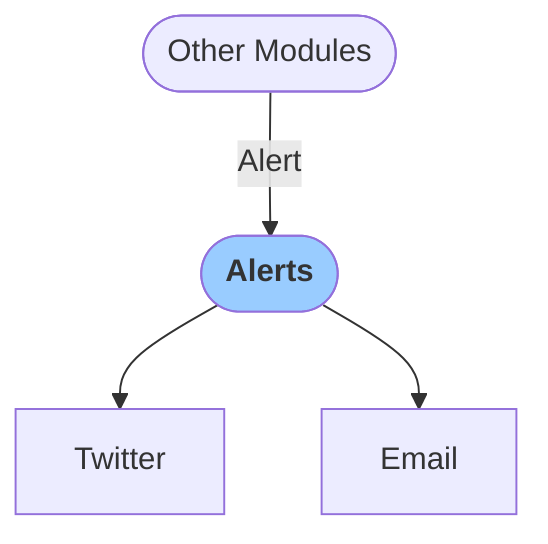

# Alerts
`Alerts` module distributes alerts to via various channels. Currently implemented channels include publishing to Twitter or Email. Let us know if you are interested in implementation of other publishing channels.

### Configuration

<b>General</b>

- `Verbose` [boolean]: If true, `Logs` are printed out

<b>Twitter alert</b>

- `Send alert` [boolean]: If set to true, alert message id going to be published on Twitter
- `Consumer key` [string]: Twitter API consumer key
- `Consumer secret` [string]: Twitter API consumer secret
- `Access token` [string]: Twitter API access token
- `Access token secret` [string]: Twitter API access token secret

<b>Email alert</b>

- `Send alert` [boolean]: If set to true, alert message id going to be delivered via email
- `List of addressees` [list]: Comma separated list of e-mail addresses 

