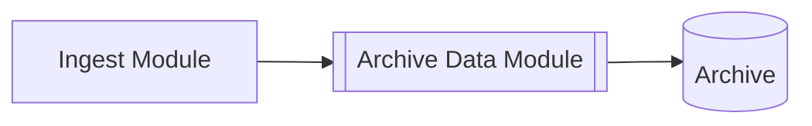

# Archive Data Stream Module
This module captures all data from the Ingest Module stream and stores it in an archive, ready for future analysis or downloading.

```mermaid
flowchart LR
   B[Ingest Module]--> Cp[[Archive Data Module]] --> id1[(Archive)]
```