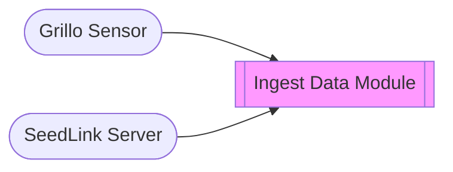

# Ingest Data module
This module is typically enabled by default. It consumes station data in real-time from your Grillo sensor or SeedLink server, converts it to [MiniSEED](http://ds.iris.edu/ds/nodes/dmc/data/formats/miniseed/) format, and makes the it available to other modules as a data stream.

