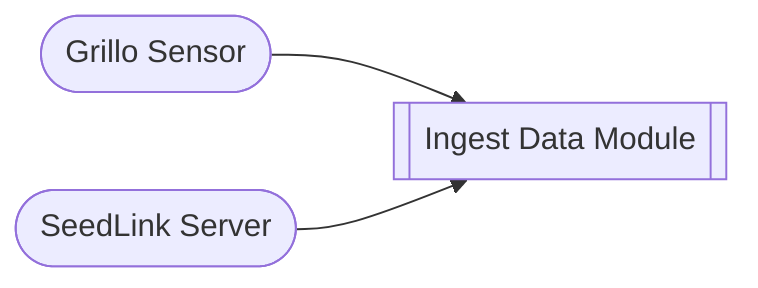

# Ingest Data module
This module is typically enable by default. It reads data in real-time from your Grillo sensor or SeedLink server, converts it to `MiniSeed` format, and makes it available to other modules or download.

