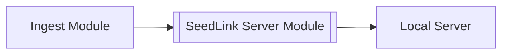

# SeedLink Server Module
This module captures all data from the Ingest Module stream and publishes it as a SeedLink Server. This can be used to relay the data stream from the cloud to an on-premise server.

