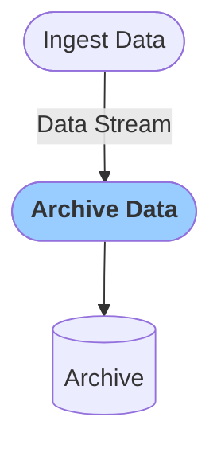

# Archive Data Stream
This module captures all data from the Ingest Module stream and stores it in an archive, ready for future analysis or downloading.
By default, data is archived in counts. In configuration you can remove the effect of the instrument response or sensitivity and archive data in acceleration or velocity units.

### Configuration

<b>Archive data</b>

- `Verbose` [boolean]: `Logs` are printed in when set to true

