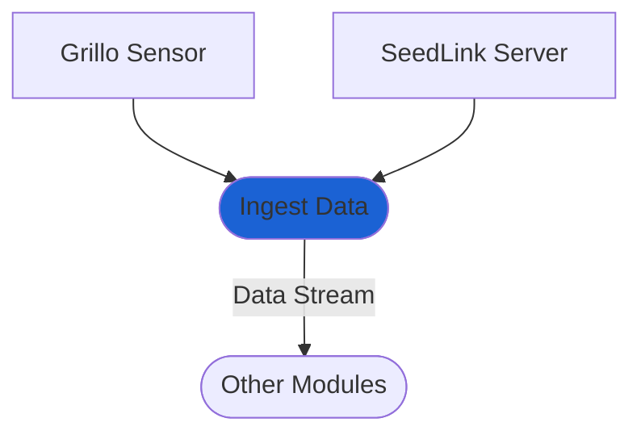

# Ingest Data module
This module is typically enabled by default. It consumes station data in real-time from your Grillo sensor or SeedLink server and makes it available to other modules as a data stream.

