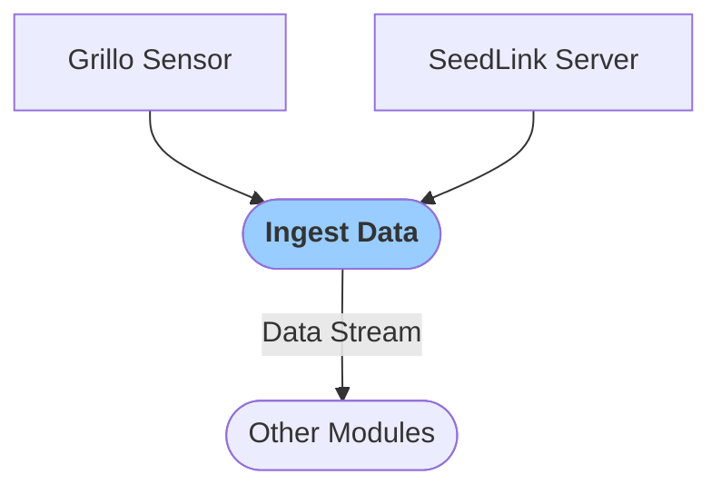

# Ingest Data
This module is typically enabled by default. It consumes station data in real-time from your Grillo sensor or SeedLink server and makes it available to other modules as a data stream.

### Configuration

<b>Ingest data</b>

- `Verbose` [boolean]: `Logs` are printed in when set to true

