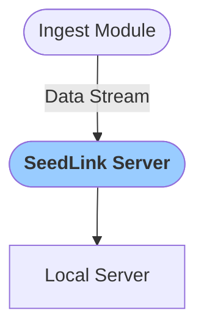

# SeedLink Server
This module captures all data from the Ingest Module stream and publishes it through a SeedLink Server. This can be used to relay the data stream from the cloud to a local server.

:::info
Only one SeedLink Module is required to stream all your sensors through as single URL.
:::

---

To find the `Ip Address` (Host Address) and `Port` for this new SeedLink Server, open the logs for the module:

### Configuration

<b>Seedlink server</b>

- `Verbose` [boolean]: `Logs` are printed in when set to true

