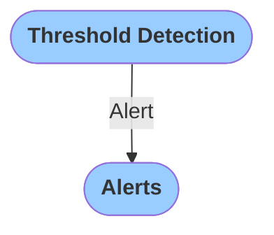

# Introduction to Modules
`Modules` are small programs that execute a single task (or a few tasks of the same kind). For example, the `Threshold Detection` module ingests sensor data and checks whether the signal amplitude has exceeded a predefined threshold. `Modules` can be linked together to create complex tasks.

`Modules` communicate with each other via passing `Objects`. `Objects` are unified JSON messages that contain a certain type of information.

These are a few most common objects passed between `Modules`:
- `Event`: A shake event, which may be recorded at a single or at multiple stations. Different modules are designed to detect different kinds of `Events` (earthquake, mine explosion, single station threshold exceedance)
- `Alert`: An object that contains an alert information. `Alert` is generated when an `Event` parameter exceeds a predefined limit.
- `Data Stream`: Real-time stream of data 

For example, `Threshold  Detection` module may create an `Alert` message that is received by the `Alerts` module that publishes the alert.

Many other objects related to `Stations` or `Events` are generated by modules and saved in the database. Those are displayed in the `Event` tab of the `Grillo Console`.
