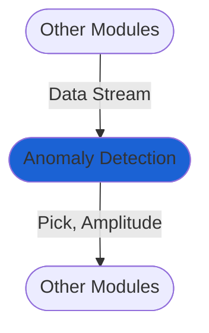

# Anomaly detection
The `Anomaly Detection` module uses [recursive STA/LTA](https://docs.obspy.org/packages/autogen/obspy.signal.trigger.recursive_sta_lta.html#obspy.signal.trigger.recursive_sta_lta) method to detect anomalous amlitudes in the real-time data stream.

It creates `Pick` and `Amplitude` objects that are passed to subsequent modules, such as those for seismic association, location and magnitude estimation.

