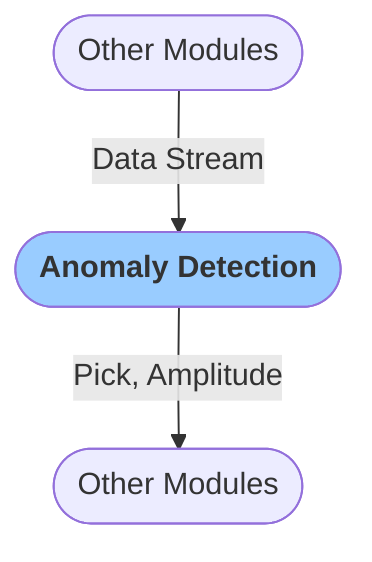

# Anomaly detection
The `Anomaly Detection` module uses [recursive STA/LTA](https://docs.obspy.org/packages/autogen/obspy.signal.trigger.recursive_sta_lta.html#obspy.signal.trigger.recursive_sta_lta) method to detect anomalous amplitudes in the real-time data stream.

It creates `Pick` and `Amplitude` objects that are passed to subsequent modules, such as those for seismic association, location and magnitude estimation.

### Configuration

<b>Detector</b>

- `Sta len` [float, seconds]: Length of the short time average (STA) window                 
- `Lta len` [float, seconds]: Length of the long time average (LTA) window                        
- `Stalta thresh` [float]: STA/LTA threshold    
- `No Det Win` [float, seconds]: Time since a detection after which no more detections are going to be issued
- `Verbose` [boolean]: `Logs` are printed in when set to true

