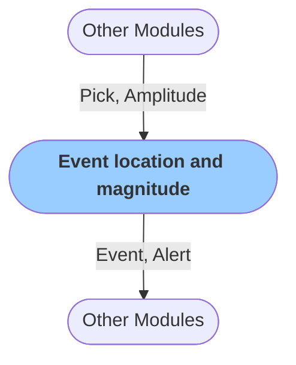

# Event location and magnitude calculation: GaMMA method
:::caution
Module currently in development.
:::
The module performs seismic association and location via the [GaMMA method.](https://agupubs.onlinelibrary.wiley.com/doi/abs/10.1029/2021JB023249). It starts with associating `Pick` objects and calculates event magnitude based on `Amplitude` readings of the P-wave [peak ground displacement](https://agupubs.onlinelibrary.wiley.com/doi/full/10.1029/2007JB005386).

The module creates `Event` and `Alert` objects that are passed to subsequent modules, such as those for alerting.

### Configuration

<b>RTCatalogue</b>

- `Use Amplitude` [boolean]: Use amplitudes and calculate magnitude
- `Dbscan eps` [float]: The time window length for pick catalogue scan
- `Dbscan min samples` [integer]: Minimum number of picks to scan
- `Min picks per eq` [integer]: Minimum number of picks associated with an event
- `Max sigma11` [float, seconds]: Maximum time sigma
- `Max sigma22` [float, seconds]: Maximum amplitude sigma
- `Max sigma12` [float, seconds]: Maximum time x amplitude sigma
- `Pvel` [float, km/s]: Constant P-wave velocity
- `Verbose` [boolean]: `Logs` are printed in when set to true

