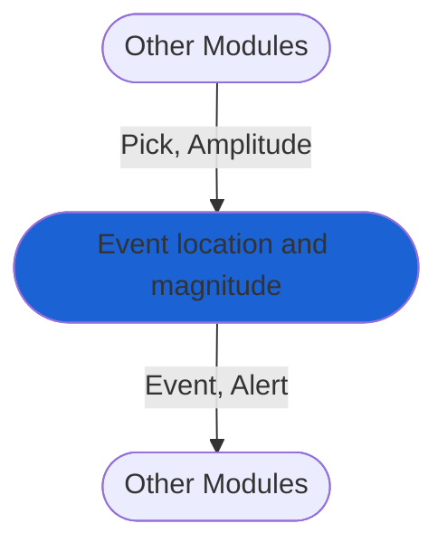

# Event location and magnitude calculation: GaMMA method
:::caution
Module currently in development.
:::
The module performs seismic association and location via the [GaMMA method.](https://agupubs.onlinelibrary.wiley.com/doi/abs/10.1029/2021JB023249). It starts with associating `Pick` objects and calculates event magnitude based on `Amplitude` readings of the P-wave [peak ground displacement](https://agupubs.onlinelibrary.wiley.com/doi/full/10.1029/2007JB005386).

The module creates `Event` and `Alert` objects that are passed to subsequent modules, such as those for alerting.

