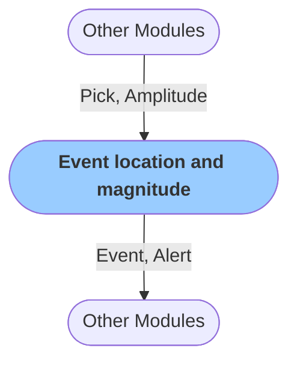

# Event location and magnitude calculation: Grid search method
The module performs seismic association, location, and magnitude estimation via the [grid search method.](https://pubs.geoscienceworld.org/ssa/bssa/article-abstract/98/3/1482/341985/Real-Time-Evolutionary-Earthquake-Location-for?redirectedFrom=fulltext). It starts with associating `Pick` objects and calculates event magnitude based on `Amplitude` readings of the P-wave [peak ground displacement](https://agupubs.onlinelibrary.wiley.com/doi/full/10.1029/2007JB005386).

The module creates `Event` and `Alert` objects that are passed to subsequent modules, such as those for alerting.

### Configuration

<b>RTCatalogue</b>

- `Tt path`: Path to travel-time grid
- `Tt x width` [float, km]: Width of the travel-time grid
- `Tt y width` [float, km]: Height of the travel-time grid
- `Tt z levels` [list of floats, km]: Depth levelt for travel-time calculation
- `Tt step` [float, km]: Depth levels for travel-time calculations 
- `Vel model`: Velocity model for travel-time calculations
- `Tsl max` [float, seconds]: Maximum time since the last detection associate with an event
- `Assoc win` [float, seconds]: Associator window
- `Ndef ratio` [float]: Minimum number of close stations associated with an event
- `Ndef min` [integer]: Minimum number of pics associated with an earthquake
- `Sigma type`: 
- `Sigma const`: 
- `Nya weight`: Not-yet arrived stations
- `Nya nos`: Not-yet arrived stations
- `Prior type` ['const']: 
- `Mc` [float]:
- `b_vlaue` [float]: B-value
- `Pgd a` [float]: Parameter for magnitude estimation M = A * B log(Pd) * C
- `Pgd b` [float]: Parameter for magnitude estimation M = A * B log(Pd) * C
- `Pgd c` [float]: Parameter for magnitude estimation M = A * B log(Pd) * C
- `Pgd std` [float]: Magnitude standard deviation
- `Verbose` [boolean]: `Logs` are printed in when set to true

