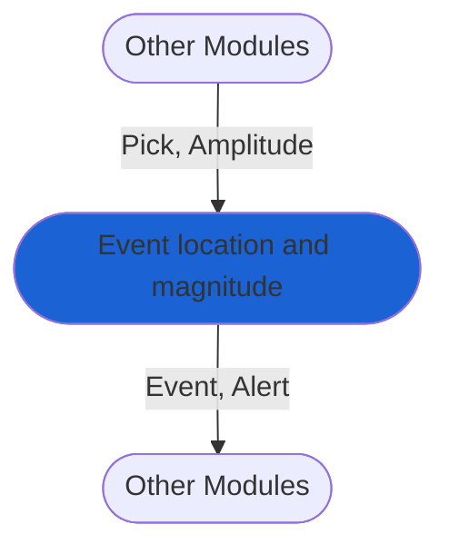

# Event location and magnitude calculation: Grid search method
The module performs seismic association, location, and magnitude estimation via the [grid search method.](https://pubs.geoscienceworld.org/ssa/bssa/article-abstract/98/3/1482/341985/Real-Time-Evolutionary-Earthquake-Location-for?redirectedFrom=fulltext). It starts with associating `Pick` objects and calculates event magnitude based on `Amplitude` readings of the P-wave [peak ground displacement](https://agupubs.onlinelibrary.wiley.com/doi/full/10.1029/2007JB005386).

The module creates `Event` and `Alert` objects that are passed to subsequent modules, such as those for alerting.

