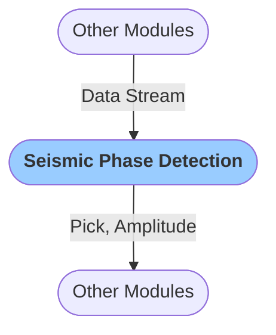

# Seismic Phase Picker
:::caution
Module currently in development.
:::
The `Seismic Phase Picker` is a neural-network picker that detects earthquake P-waves at Grillo sensors. The picker was created by retraining [PhaseNet network](https://academic.oup.com/gji/article/216/1/261/5129142) on Grillo Sensor data from a Mexican network deployment.

It creates `Pick` and `Amplitude` objects that are passed to subsequent modules, such as those for seismic association, location and magnitude estimation.

### Configuration

<b>Detector</b>

- `Max window` [float]: Maximum time window after now after which new detections are declared
- `ML thresh` [float]: Threshold for phase detection
- `No Det Win` [float, seconds]: Time since a detection after which no more detections are going to be issued
- `Verbose` [boolean]: `Logs` are printed in when set to true

