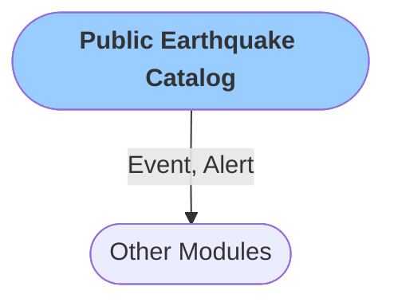

# Public Earthquake Catalog
The module enables you to obtain any seismic catalogue available via the [FDSN service](https://docs.obspy.org/packages/obspy.clients.fdsn.html). The module updates the catalogue periodically and creates `Event` and `Alert` (optionally) objects that can be used by subsequent modules. 

### Configuration

<b>Catalog</b>

- `Send alert` [boolean]: Publishes an aler message on new event
- `Verbose` [boolean]: `Logs` are printed in when set to true

