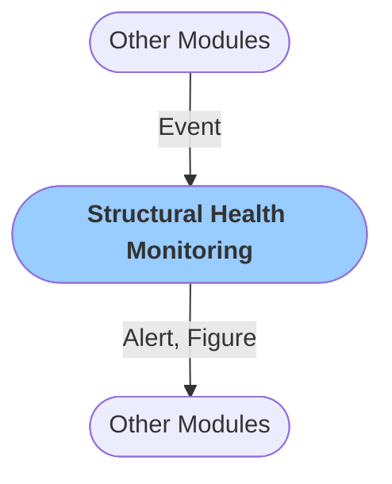

# Structural Health Monitoring
The `Structural Health Monitoring` module enables you to calculate and plot signal properties in time and frequency domain and issue `Alerts` in case a threshold is exceeded.

The module receives the `Event` object and processes a 5-minute signal window after the origin time of the event.

You can claculate and plot the following signal properties:

In time domain:
- `Acceleration`
- `Velocity`
- `Displacement`

In the frequency domain:
- `Spectral Acceleration`
- `Pseudo-Spectral Acceleration`
- `Spectral Velocity`
- `Pseudo-Spectral Velocity`
- `Spectral Displacement`
- `Acceleration Power Spectral Density`
- `Velocity Power Spectral Density`
- `Displacement Power Spectral Density`

You can choose one or multiple signal parameters and set a threshold value for an `Alert` to be issued.

### Configuration

<b>General</b>

- `Verbose` [boolean]: `Logs` are printed in when set to true

<b>Acceleration</b>

- `Peak Value Alert` [boolean]: Turn on trigger for exceedance
- `Threshold` [float]: Threshold for alert
- `Plot` [boolean]: Plot and save a figure

<b>Velocity</b>

- `Peak Value Alert` [boolean]: Turn on trigger for exceedance
- `Threshold` [float]: Threshold for alert
- `Plot` [boolean]: Plot and save a figure

<b>Displacement</b>

- `Peak Value Alert` [boolean]: Turn on trigger for exceedance
- `Threshold` [float]: Threshold for alert
- `Plot` [boolean]: Plot and save a figure

<b>Spectral Acceleration</b>

- `Peak Value Alert` [boolean]: Turn on trigger for exceedance
- `Threshold` [float]: Threshold for alert
- `Plot` [boolean]: Plot and save a figure

<b>Pseudo-Spectral Acceleration</b>

- `Peak Value Alert` [boolean]: Turn on trigger for exceedance
- `Threshold` [float]: Threshold for alert
- `Plot` [boolean]: Plot and save a figure

<b>Spactral Velocity</b>

- `Peak Value Alert` [boolean]: Turn on trigger for exceedance
- `Threshold` [float]: Threshold for alert
- `Plot` [boolean]: Plot and save a figure

<b>Pseudo Spectral Velocity</b>

- `Peak Value Alert` [boolean]: Turn on trigger for exceedance
- `Threshold` [float]: Threshold for alert
- `Plot` [boolean]: Plot and save a figure

<b>Spectral Displacement</b>

- `Peak Value Alert` [boolean]: Turn on trigger for exceedance
- `Threshold` [float]: Threshold for alert
- `Plot` [boolean]: Plot and save a figure

