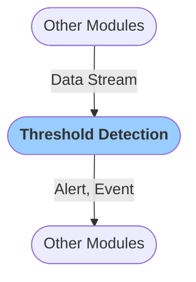

# Threshold Detection
The `Threshold Detection` module enables you to set triggers based on maximum acceleration, velocity, or displacement recorded by your sensor. You can choose to publish an Alert message when the threshold value is exceeded.

When the threshold value is exceeded, the module produces `Events` that are displayed in the `Event` tab in the Grillo Console.

