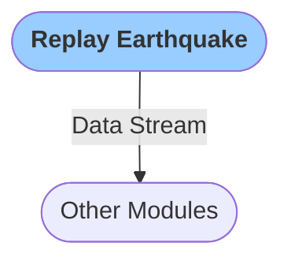

# Replay Earthquake
:::caution
Module currently in development.
:::

`Replay Earthquake` enables you to test your workflow by sending data from a historical earthquake.

```mermaid
flowchart TB
   B([<font color=333333><b>Replay Earthquake</b>])-->|Data Stream| C([Other Modules])
   style B fill:#99CCFF
```
