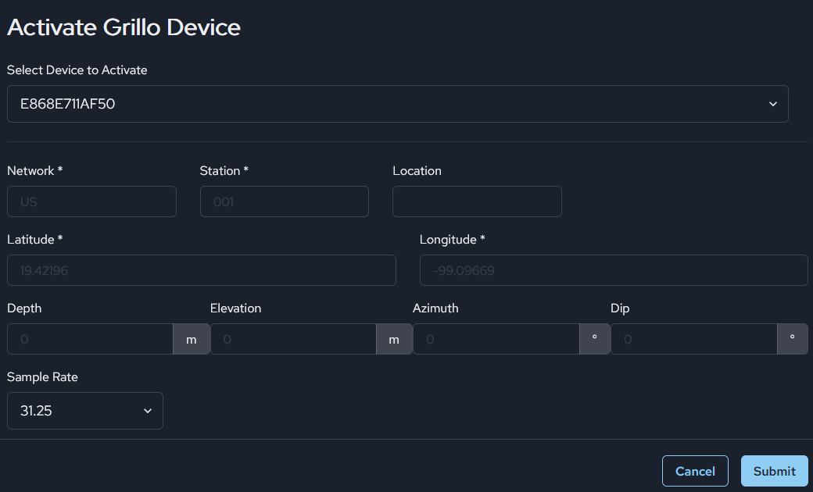

# Add Grillo Sensors
Grillo sensors can be easily connected to the Grillo Console with a few clicks.

## Connect your device
First, you will want your device to be connected to the cloud. Please follow the instructions for [connecting your sensor](../../grillo-sensors/connecting_sensor).

## Add to Grillo Console
Once you are logged in, go to the `Stations` tab in the app, and click on `Add Station` button.

Choose Grillo sensor:

Choose from a list of devices that are registered to your acount, and then fill in the station information for this device:

The required details include:
- `Network` and `Station` code as a unique identifier for your seismic station. Codes should follow [FDSN conventions](https://www.fdsn.org/) - preferably two letters for the network, 4-5 alphanumeric code for the station code. All letters should be capital.
- `Latitude` and `Longitude`. These are required to locate your station.

Once this is all done, after a minute or so you should see your sensor as active in your sensor list:

Here you can confirm that the deviceID (`Mac Address`), as printed on your sensor, is the same one that is being shown.

