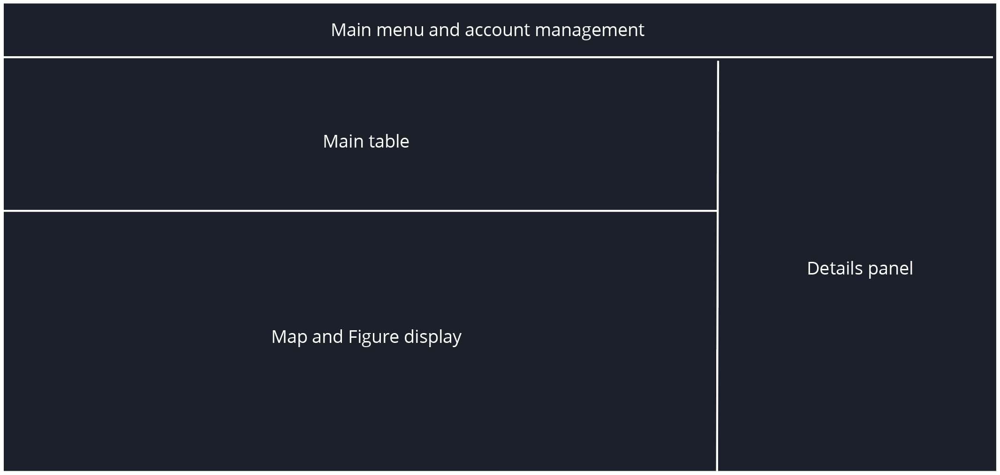

# Introduction to Stations
The Station page serves for display and management of station fleet.

The page has three main sections.
- `Main table`: Displays stations associated with the account
- `Map and Figure area`: Displays station locations and figures
- `Details panel`: Displays details about the selected stations, enables configuration and station deactivation

In the following sections we will show how to use the Station page to manage your sensor fleet.
