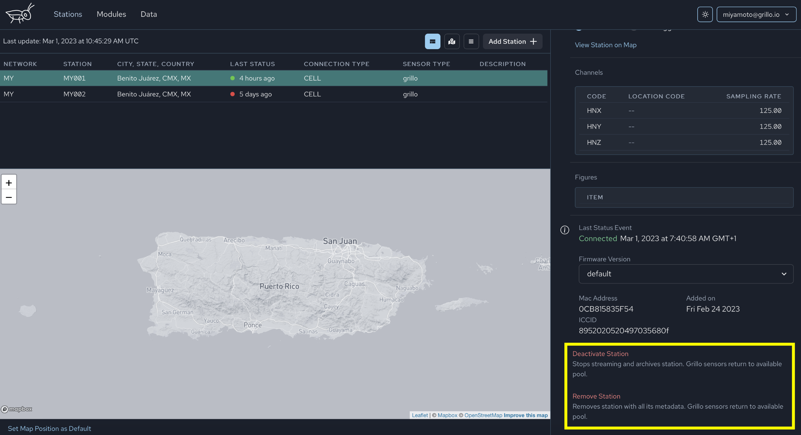

# Station deactivation and removal
If you want to relocate your Grillo sensor or you just wish to stop the data from the station to your platform, you have two options: `Deactivate` or `Remove` the station.

:::caution  
Removing or Deactivating a station in the Grillo Console does not stop the sensor itself and you will need to unplug the device in order to stop it.
:::

### Deactivate station
This option stops station data stream and archives station. Grillo sensors return to available pool so you can use the sensor to set up a new station. The station will still remain visible on your account, but it will be greyed out and it won't be streaming real time data anymore. However, you will be able to access the station metadata and archive.

### Remove station
This option stops station data stream and removes the station with all its metadata. Grillo sensors return to available pool so you can use the sensor to set up a new station. The station will no longer be visible on your account and you won't be able to account archived data or any station products.
