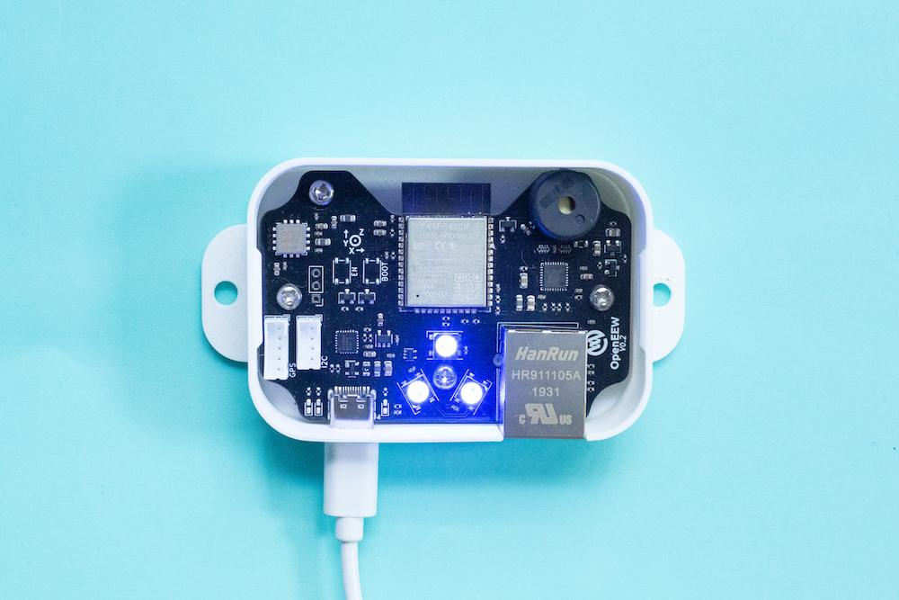

# What is a Grillo Sensor?
Grillo sensor is a strong-motion seismometer that features a low-noise MEMs accelerometer. The sensor is connected to Grillo Console using Internet of Things (IoT) infrastructure, where it transmits data in near real-time.

There are two kinds of Grillo Sensors that differ mainly in connectivity options. [Grillo Air](grillo_air.md) connects to the Grillo Console via either cellular internet or a Wi-Fi network, [Grillo Connect](grillo_connect.md) uses either connection with LAN cable or a Wi-Fi network.

[Here](docs/grillo_sensor_white_paper.pdf) you can find a short report on the sensor performance.