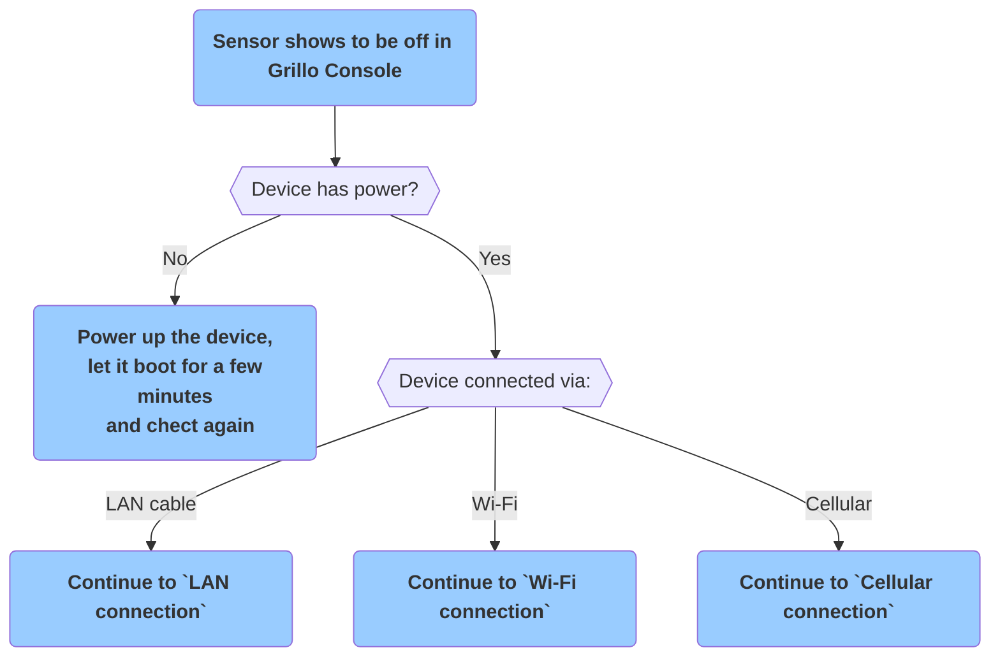

# Connection troubleshooting

```mermaid
graph TB
   A(<font color=333333><b>Sensor shows to be off in Grillo Console</b>) --> B{{Device has power?}}
   B -->|No| H(<font color=333333><b>Power up the device,\n let it boot for a few minutes\n  and chect again</b>)
   B -->|Yes| C{{Device connected via:}}
   C -->|LAN cable| G(<font color=333333><b>Continue to `LAN connection`</b>)
   C -->|Wi-Fi| E(<font color=333333><b>Continue to `Wi-Fi connection`</b>)
   C -->|Cellular| F(<font color=333333><b>Continue to `Cellular connection`</b>)

   style A fill:#99CCFF
   style H fill:#99CCFF
   style G fill:#99CCFF
   style E fill:#99CCFF
   style F fill:#99CCFF
```

### 

<b>Cellular connection</b>

<b>Wi-Fi connection</b>

<b>LAN connection</b>

