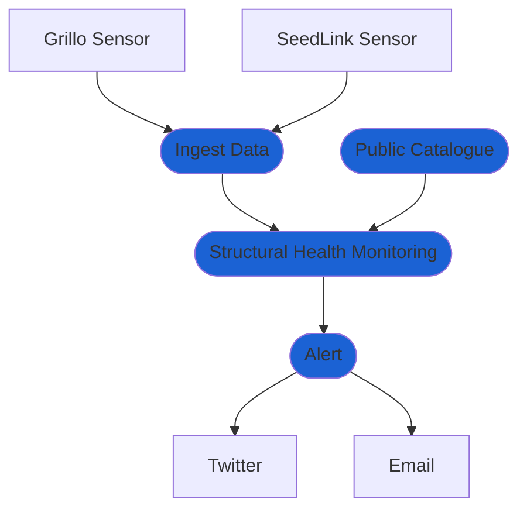

# Create advanced Structural Monitoring Solution
In a more complex case, we want to monitor the shaking of a structure, calculate spectral properties of the signal, generate graphics and receive an alert whenever the amplitude exceeds a predefined limit.

- `Ingest Data` module ingests data from Grillo Sensors and prepares them from processing
- `Threshold Detection` module gets the data and evaluates whether the amplitude (in acceleration, velocity, or displacement) exceeded a predefined threshold. If so, it publishes an alert message
- `Alert` module distributes alert messages via channels such as e-mail or Twitter