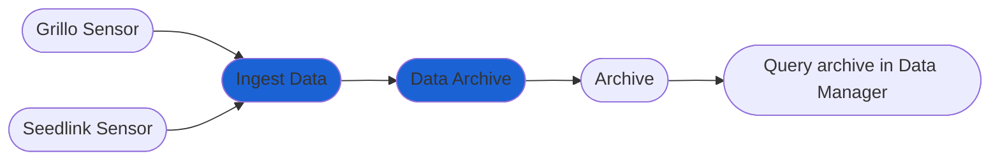

# Archive Data
You can simply archive all sensor data and use them for your own analysis. The archived data can be accessed in <em>Download Manager</em> tab in the <em>Event</em> section.

- <em>Ingest Data</em> module ingests data from Grillo Sensors and prepares them from processing
- <em>Data Archive</em> module archives data in MSEED format