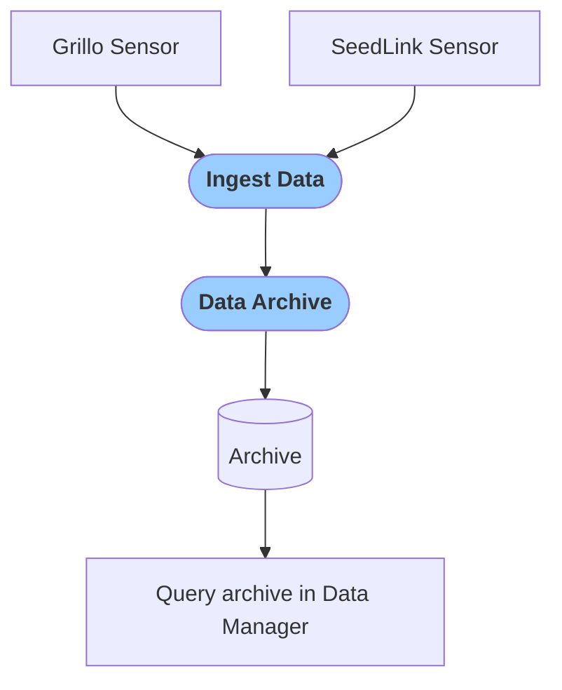

# Archive Data
You can simply archive all sensor data and use them for your own analysis. The archived data can be accessed in `Download Manager` tab in the `Event` section.

- `Ingest Data` module ingests data from Grillo Sensors and prepares them from processing
- `Data Archive` module archives data in MSEED format