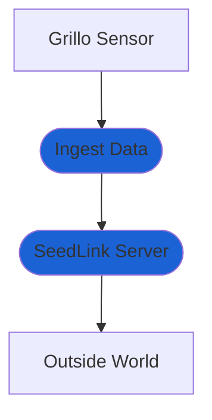

# Redirect Data Flow
You can redirect the data flow and stream all data to your own system. This is done by starting a SeedLink Server that offers Grillo Sensor data in real time.

- `Ingest Data` module ingests data from Grillo Sensors and prepares them from processing
- `SeedLink Server` starts SeedLink server