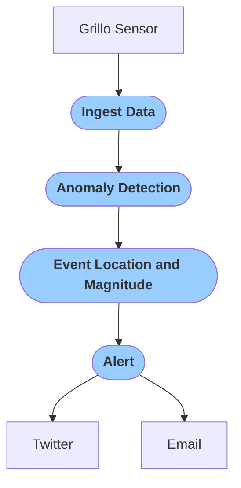

# Create Earthquake Early-Warning System
An EEW is a system that detects an earthquake in its early stage, evaluates its location and magnitude and issues alerts to people in the affected region.

Creating an EEW requires a relatively dense network of real-time sensors, such as a Grillo Sensor, located strategically in areas of high seismic hazard. Such a network is usually formed by tens to hundreds of sensors that transmit data to servers in near real-time.

Grillo has the capacity to facilitate EEW networks. Below we display an example workflow in Grillo Console.

- `Ingest Data` module ingests data from Grillo Sensors and prepares them from processing
- `Anomaly Detection` module gets the data and uses STA/LTA method to detect anomalous shaking amplitudes at individual stations
- `Event Location and Magnitude` module gathers detections from individual stations, associates them into events and estimates event location and magnitude. For large events, it issues and alert message
- `Alert` module distributes alert messages via channels such as e-mail or Twitter
