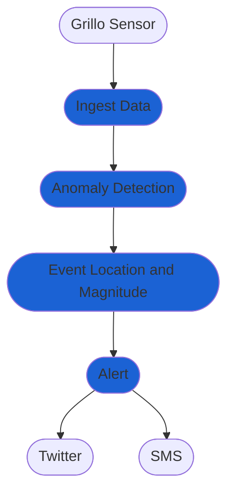

# Create Earthquake Early-Warning System
An EEW is a system that detects an earthquake in its early stage, evaluates its location and magnitude and issues alerts to people in the affected region.

Creating an EEW requires relatively dense network of real-time sensors, such as a Grillo Sensor, located strategically in areas of high seismic hazard. Such network is usually formed by tens to hundreds of sensors that transmit data to a servers in near real-time.

Grillo has the capacity to facilitate EEW networks. Below we display and example workflow in Grillo Console.

- <em>Ingest Data</em> module ingests data from Grillo Sensors and prepares them from processing
- <em>Anomaly Detection</em> module gets the data and uses STA/LTA method to detect anomalous shaking amplitudes at individual stations
- <em>Event Location and Magnitude</em> module gathers detections from individual stations, associates them into events and estimates event location and magnitude. For large events, it issues and alert message
- <em>Alert</em> module distributes alert messages via channels such as e-mail or Twitter